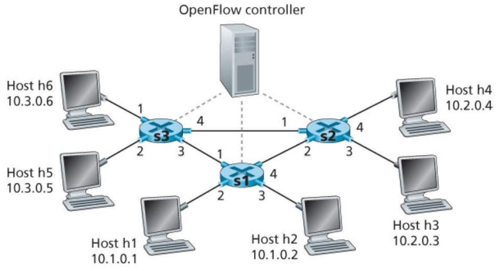

### 1. 考虑回退N帧（GBN）协议，其发送方窗口大小为4，序号范围为1~1024。假设在时刻t，接收方期望收到的下一个按序分组的序号为k，且传输介质不会对报文重排序。回答以下问题：
a. t时刻发送方窗口内可能的序号集合是什么？请说明理由。
b. 目前正在向发送方回传的所有可能报文中，确认（ACK）字段的所有可能值是什么？请说明理由。

---

### 2. 考虑图1所示的软件定义网络（SDN）OpenFlow网络。假设到达交换机S1的数据包需满足以下转发需求：
（注：图1中网络拓扑关联如下：控制器连接交换机；主机h1（10.1.0.1）、h2（10.1.0.2）、h3（10.2.0.3）、h4（10.2.0.4）、h5（10.3.0.5）、h6（10.3.0.6）分别通过对应端口连接交换机）
- 从输入端口4接收的、来自主机h3或h4且目的地为主机h5或h6的数据包，需通过输出端口1转发；
- 从输入端口4接收的、来自主机h5或h6且目的地为主机h3或h4的数据包，需通过输出端口4转发；
- 从输入端口1或4接收的、目的地为主机h1或h2的数据包，需交付至指定主机；
- 主机h1和h2应能相互发送数据包。

请指定交换机S1中实现该转发行为的流表项。

c. 给出交换机S3的流表，实现以下防火墙行为：仅允许来自主机h2和h3的流量被交付至主机h5或h6；来自主机h1和h4的流量需被阻断。

---

### 3. 考虑某段时间内有10个数据包到达路由器的某条输出链路，相关信息如下表所示。时间采用“时隙化”方式，时隙起始时刻为t=0、1、2、3……每个时隙开始时，分组调度器会从排队的数据包（若有）中选择一个，按照选定的分组调度机制进行传输。每个数据包的传输恰好占用1个时隙——若某个数据包在时刻t被选中传输，将在t+1时刻完成传输，届时调度器会从剩余排队数据包中再次选择下一个传输。以下为各数据包的类别分配：

| 数据包编号 | 1 | 2 | 3 | 4 | 5 | 6 | 7 | 8 | 9 | 10 |
| --- | --- | --- | --- | --- | --- | --- | --- | --- | --- | --- |
| 到达时间 | 0.35 | 0.85 | 1.25 | 1.68 | 1.97 | 2.2 | 2.93 | 3.24 | 3.55 | 3.95 |
| 类别 | 2 | 2 | 2 | 3 | 2 | 1 | 2 | 3 | 3 | 2 |

a. 采用优先级调度机制进行传输调度（类别1优先级最高，类别3优先级最低）。
b. 采用轮询调度机制进行传输调度。

# 网络原理作业三解答
## 一、GBN协议相关问题
### （一）发送方窗口内可能的序号集合
接收方现在等着要k号分组，说明k之前的所有分组都已经确认收到了。GBN协议的发送方窗口大小是4，而且窗口是连续的，不能断开。所以发送方窗口的起始序号最小是k，最大只能到k+3（要是起始序号比k+3还大，窗口就超出没确认的范围了，不符合协议逻辑）。

所以可能的序号集合就是这四个：[k, k+1, k+2, k+3]、[k+1, k+2, k+3, k+4]、[k+2, k+3, k+4, k+5]、[k+3, k+4, k+5, k+6]，所有序号都在1~1024的范围内哈。

### （二）ACK字段的可能值
ACK字段其实就是接收方接下来想收到的分组序号，GBN是按序确认的，不会跳着确认。

最小的ACK值是k，这时候接收方还没收到k号分组，只能确认k之前的；最大的ACK值是k+4，这时候接收方已经把窗口里的k、k+1、k+2、k+3这四个分组都按顺序收到了，接下来就等k+4。

中间还有k+1、k+2、k+3这三种情况，分别对应接收方收到了1个、2个、3个按序分组。所以ACK的可能值就是k、k+1、k+2、k+3、k+4。

## 二、SDN OpenFlow流表配置
### （一）交换机S1的流表项
| 匹配条件 | 动作 |
|----------|------|
| 入端口=4，源IP=10.2.0.3（h3），目的IP=10.3.0.5（h5） | 输出端口1 |
| 入端口=4，源IP=10.2.0.3（h3），目的IP=10.3.0.6（h6） | 输出端口1 |
| 入端口=4，源IP=10.2.0.4（h4），目的IP=10.3.0.5（h5） | 输出端口1 |
| 入端口=4，源IP=10.2.0.4（h4），目的IP=10.3.0.6（h6） | 输出端口1 |
| 入端口=4，源IP=10.3.0.5（h5），目的IP=10.2.0.3（h3） | 输出端口4 |
| 入端口=4，源IP=10.3.0.5（h5），目的IP=10.2.0.4（h4） | 输出端口4 |
| 入端口=4，源IP=10.3.0.6（h6），目的IP=10.2.0.3（h3） | 输出端口4 |
| 入端口=4，源IP=10.3.0.6（h6），目的IP=10.2.0.4（h4） | 输出端口4 |
| 入端口=1或4，目的IP=10.1.0.1（h1） | 输出到h1的接入端口 |
| 入端口=1或4，目的IP=10.1.0.2（h2） | 输出到h2的接入端口 |
| 源IP=10.1.0.1（h1），目的IP=10.1.0.2（h2） | 输出到h2的接入端口 |
| 源IP=10.1.0.2（h2），目的IP=10.1.0.1（h1） | 输出到h1的接入端口 |

### （二）交换机S3的流表项（防火墙行为）
| 匹配条件 | 动作 |
|----------|------|
| 源IP=10.1.0.2（h2），目的IP=10.3.0.5（h5） | 允许转发（输出到对应端口） |
| 源IP=10.1.0.2（h2），目的IP=10.3.0.6（h6） | 允许转发（输出到对应端口） |
| 源IP=10.2.0.3（h3），目的IP=10.3.0.5（h5） | 允许转发（输出到对应端口） |
| 源IP=10.2.0.3（h3），目的IP=10.3.0.6（h6） | 允许转发（输出到对应端口） |
| 源IP=10.1.0.1（h1），目的IP=10.3.0.5（h5） | 丢弃 |
| 源IP=10.1.0.1（h1），目的IP=10.3.0.6（h6） | 丢弃 |
| 源IP=10.2.0.4（h4），目的IP=10.3.0.5（h5） | 丢弃 |
| 源IP=10.2.0.4（h4），目的IP=10.3.0.6（h6） | 丢弃 |

## 三、分组调度算法
### （一）优先级调度（类1最高，类3最低）
调度规则：先传类1，再类2，最后类3；同类按到达时间早的先传，每个时隙传1个。

| 时隙t | 传输分组 | 原因 |
|-------|----------|------|
| 1     | 1        | 类2，到达0.35，是最早到的高优先级分组（类1暂无） |
| 2     | 2        | 类2，到达0.85，下一个类2分组 |
| 3     | 6        | 类1，唯一的类1分组，优先级最高 |
| 4     | 3        | 类2，到达1.25，剩下的类2里最早的 |
| 5     | 5        | 类2，到达1.97，下一个类2分组 |
| 6     | 7        | 类2，到达2.93，下一个类2分组 |
| 7     | 10       | 类2，到达3.95，最后一个类2分组 |
| 8     | 4        | 类3，到达1.68，最早到的类3分组 |
| 9     | 8        | 类3，到达3.24，下一个类3分组 |
| 10    | 9        | 类3，到达3.55，最后一个类3分组 |

### （二）轮询调度（类1→类2→类3循环）
调度规则：按类1→类2→类3循环分配传输机会，有对应类分组就传最早到的，没有就跳过。

| 时隙t | 传输分组 | 原因 |
|-------|----------|------|
| 1     | 1        | 循环到类1（无分组）→ 类2（有分组，最早是1） |
| 2     | 2        | 循环到类3（无分组）→ 类1（无）→ 类2（下一个是2） |
| 3     | 4        | 循环到类3（有分组，最早是4） |
| 4     | 6        | 循环到类1（有分组，仅6） |
| 5     | 3        | 循环到类2（剩下的最早是3） |
| 6     | 8        | 循环到类3（剩下的最早是8） |
| 7     | 5        | 循环到类1（无）→ 类2（剩下的最早是5） |
| 8     | 9        | 循环到类3（剩下的最早是9） |
| 9     | 7        | 循环到类1（无）→ 类2（剩下的最早是7） |
| 10    | 10       | 循环到类3（无）→ 类1（无）→ 类2（最后一个是10） |

要不要我帮你把**分组调度的时序图草图**整理出来，更直观地展示每个分组的传输时间线？